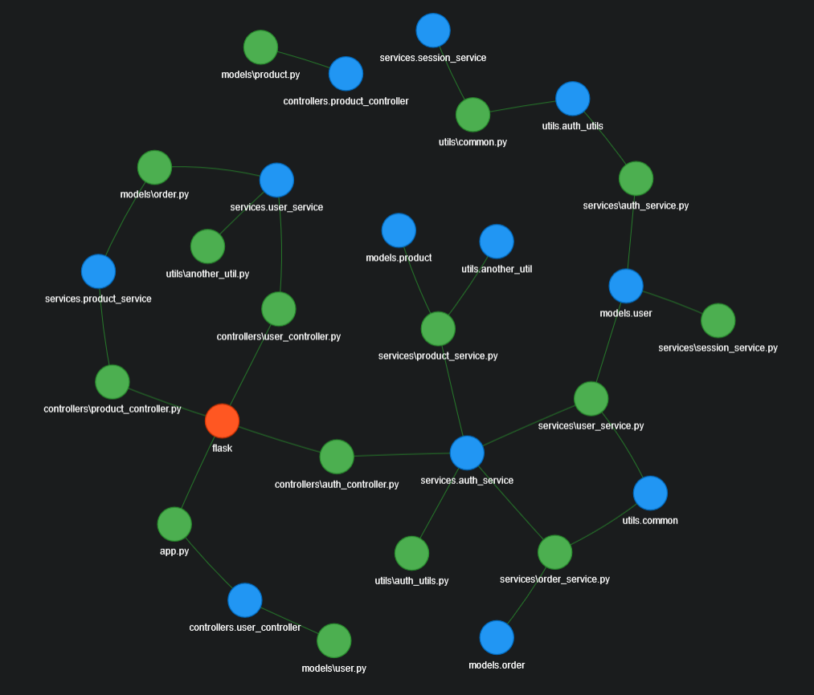

# import-graph-visualizer

Visualizes the import graph of a Python project.



## Usage

1. Install the required packages:

```bash
pip install -r requirements.txt
```

2. Run the `main.py` script when it is next to the Python code base folder you want to visualize.
3. Open the generated `import_graph.html` file in a web browser.

## Features

-   The graph is interactive and can be zoomed in and out and moved around.
-   There is a physics simulation that makes the graph look more natural.
-   Orange nodes are external dependencies, blue nodes are internal modules, and green nodes are the Python files.
